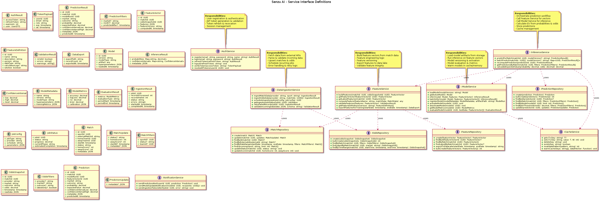

# Service Interface Definitions

This diagram defines the interfaces (contracts) for all services in the system. It shows
the methods each service exposes and the data transfer objects (DTOs) they use.

### Service Interfaces:
- **IAuthService**: User authentication and token management
- **IInferenceService**: Prediction orchestration and EV calculation
- **IFeatureService**: Feature engineering and validation
- **IModelService**: Model loading, inference, and evaluation
- **IDataIngestionService**: External data fetching and validation
- **Repository Interfaces**: Data access for matches, odds, predictions, features
- **ICacheService**: Caching operations with pattern invalidation

### Design Principles:
- Clear separation of concerns
- Dependency injection friendly
- Testable interfaces
- Comprehensive type definitions

## Diagram

## Related Diagrams

## Source

This documentation was automatically generated from PlantUML diagrams.

- Source file: [`../puml/senzu-ai-service-interfaces.puml`](../puml/senzu-ai-service-interfaces.puml)
- Image: [`../images/senzu-ai-service-interfaces.png`](../images/senzu-ai-service-interfaces.png)

## Navigation

Return to [Documentation Index](./README.md)
