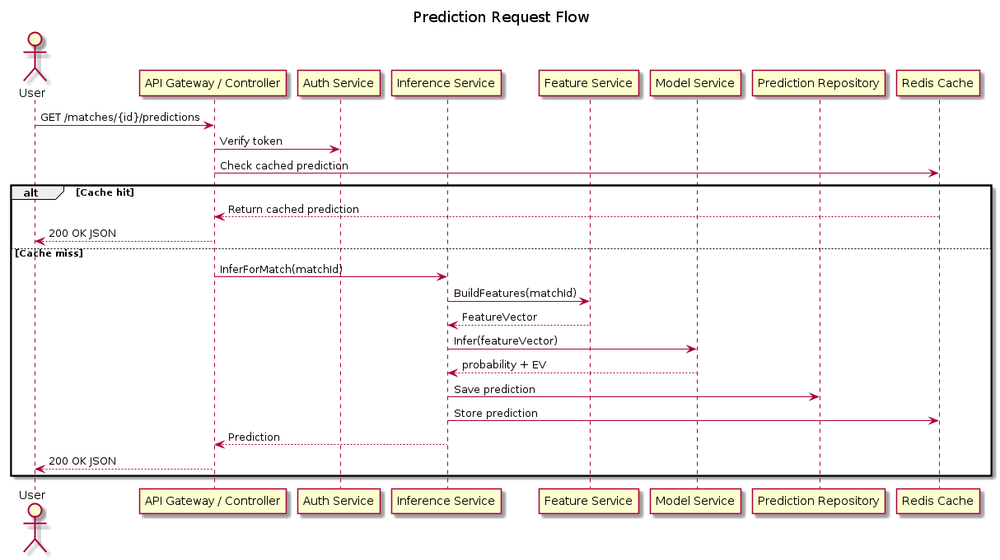

# Prediction Request Flow

This sequence diagram shows the high-level flow of a prediction request from a user through the system.
It demonstrates how different services collaborate to generate predictions.

### Flow Steps:
1. Client sends prediction request to API Gateway
2. Authentication is verified
3. Cache is checked for existing predictions
4. If cache miss, Inference Service orchestrates prediction
5. Feature Service builds feature vector from match data
6. Model Service loads model and runs inference
7. Prediction is stored and cached
8. Response is returned to client

### Performance Optimizations:
- Redis caching reduces redundant computations
- Feature vectors are reused across predictions
- Models are kept warm in memory

## Diagram

## Related Diagrams

- [Backend Architecture](./senzu-ai-backend-architecture.md)
- [Service Interfaces](./senzu-ai-service-interfaces.md)

## Source

This documentation was automatically generated from PlantUML diagrams.

- Source file: [`../puml/senzu-ai-sequence-diagram.puml`](../puml/senzu-ai-sequence-diagram.puml)
- Image: [`../images/senzu-ai-sequence-diagram.png`](../images/senzu-ai-sequence-diagram.png)

## Navigation

Return to [Documentation Index](./README.md)
