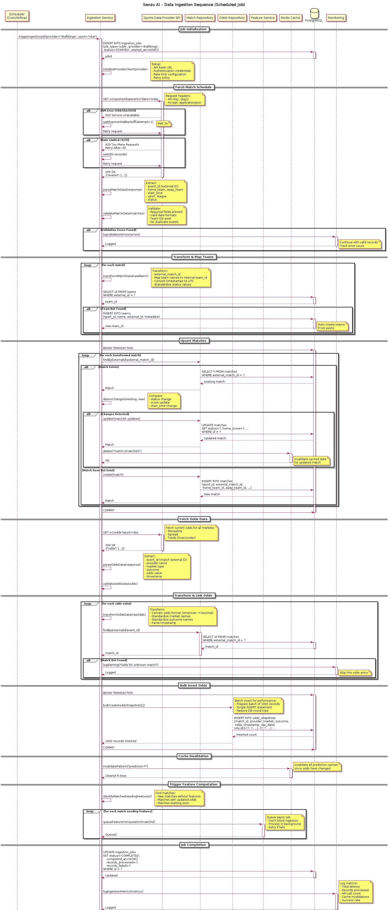

# Data Ingestion Sequence (Scheduled Job)

This sequence diagram illustrates the complete data ingestion process, from fetching data
from external providers to storing it in the database and triggering downstream processes.

### Ingestion Steps:
1. **Job Initialization**: Create job record, initialize API client
2. **Fetch Match Schedule**: GET request to provider API with retry logic
3. **Fetch Odds Data**: Retrieve current odds for all markets
4. **Data Validation**: Schema validation, duplicate detection
5. **Data Transformation**: Map external IDs, convert formats, standardize names
6. **Team Management**: Create new teams if not found
7. **Upsert Matches**: Insert new matches or update existing ones
8. **Bulk Insert Odds**: Batch insert odds snapshots for performance
9. **Cache Invalidation**: Clear prediction caches for updated matches
10. **Trigger Feature Computation**: Queue async jobs for new/updated matches
11. **Job Completion**: Update job status and log metrics

### Error Handling:
- Exponential backoff for retryable errors (500, 502, 503, 429)
- Skip invalid records and continue with valid ones
- Transaction rollback on fatal errors
- Alert on job failures

## Diagram

## Related Diagrams

- [Backend Architecture](./senzu-ai-backend-architecture.md)
- [Service Interfaces](./senzu-ai-service-interfaces.md)

## Source

This documentation was automatically generated from PlantUML diagrams.

- Source file: [`../puml/senzu-ai-ingestion-sequence.puml`](../puml/senzu-ai-ingestion-sequence.puml)
- Image: [`../images/senzu-ai-ingestion-sequence.png`](../images/senzu-ai-ingestion-sequence.png)

## Navigation

Return to [Documentation Index](./README.md)
