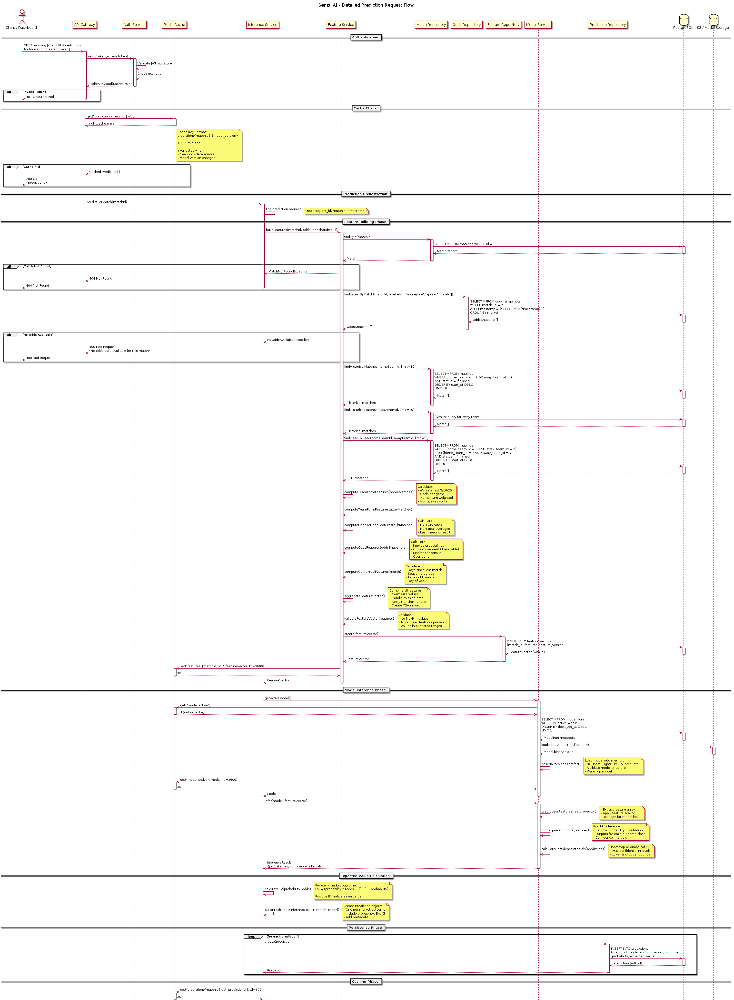

# Detailed Prediction Request Flow

This comprehensive sequence diagram details the complete prediction flow from authentication
through feature building, model inference, EV calculation, and caching.

### Detailed Steps:
1. **Authentication Phase**: Token verification
2. **Cache Check**: Redis lookup for existing predictions
3. **Feature Building**:
   - Fetch match and team data
   - Retrieve historical matches
   - Compute form, H2H, and odds features
   - Validate and store feature vector
4. **Model Inference**:
   - Load active model from cache or S3
   - Run inference on feature vector
   - Calculate confidence intervals
5. **EV Calculation**: Compute expected value from probabilities and odds
6. **Persistence**: Store predictions in database
7. **Caching**: Cache results in Redis
8. **Monitoring**: Log metrics and latency

### Performance Metrics:
- Feature building: ~200-500ms
- Model inference: ~50-100ms
- Total latency: ~300-700ms (cache miss)
- Cache hit: ~10-20ms

## Diagram

## Related Diagrams

- [Backend Architecture](./senzu-ai-backend-architecture.md)
- [Service Interfaces](./senzu-ai-service-interfaces.md)

## Source

This documentation was automatically generated from PlantUML diagrams.

- Source file: [`../puml/senzu-ai-prediction-flow-detailed.puml`](../puml/senzu-ai-prediction-flow-detailed.puml)
- Image: [`../images/senzu-ai-prediction-flow-detailed.png`](../images/senzu-ai-prediction-flow-detailed.png)

## Navigation

Return to [Documentation Index](./README.md)
